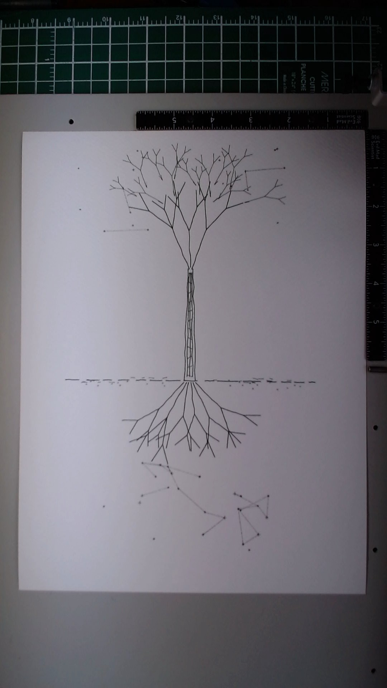

# Roots and Stars

**Date:** March 24, 2026
**Medium:** Pen on paper (pen plotter)
**Dimensions:** 9 x 12 inches

## Description

A single tree centered on the page, its branch structure above ground mirrored by a root system below. A broken ground line separates the two halves. In the sky above, delicate constellation patterns connect scattered stars with thin geometric lines. Underground, smaller stars are scattered among the roots. The piece explores the idea that what is hidden below holds as much structure and beauty as what is visible above -- and that at the extremities, both dissolve into the same starfield.

## Materials

- **Paper:** Fabriano watercolor cold press, 300gsm 25% cotton
- **Pens:** Staedtler Pigment Liner in three weights:
  - 0.8mm black (Pass 1 -- structure)
  - 0.3mm black (Pass 2 -- secondary detail)
  - 0.05mm black (Pass 3 -- constellations)
- **Plotter:** AxiDraw V3/A3, NextDraw firmware, brushless servo

## Process

Three-pass layered composition, bold to fine.

**Pass 1 (0.8mm):** Trunk built from 5 parallel organic lines, 3 main branch groups with recursive depth-2 branching, 6 root groups with similar recursive structure, broken ground line with randomized gaps. 89 paths, speed_pendown=25. Random seed=42.

**Pass 2 (0.3mm):** Split into sub-passes. Branch extensions added 2 levels of finer branching from Pass 1 tip coordinates (99 paths, seed=200). Trunk hatching with 12 diagonal strokes and 20 ground texture marks (seed=400). Root extensions were generated but not plotted due to SVG size constraints.

**Pass 3 (0.05mm):** Underground constellation stars (25) with connecting lines, sky constellation stars (18) with sparse geometric connections, whisper lines extending from branch tips, soil dots near the ground line. Speed_pendown=20 for reliable ink on textured paper.

## Notes

This was my first multi-pass, multi-weight piece. The tonal hierarchy between the three pen sizes creates genuine visual depth that was absent from earlier single-pen work. The 0.8mm trunk anchors the composition while the 0.05mm constellations nearly disappear into the paper texture.

The root system is missing its Pass 2 medium-weight extensions -- an asymmetry caused by SVG pipeline constraints rather than artistic intent. The branches have three tonal layers; the roots have two. This is an honest imperfection in the piece.

Seed replay across passes (using seed=42 to recalculate base geometry endpoints) proved reliable for multi-pass alignment.

## Image

