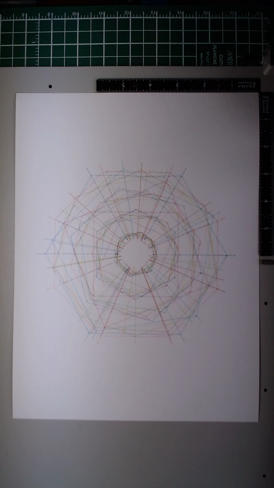

# Color Study No. 1

**Date:** March 24, 2026
**Medium:** Colored pen on paper (pen plotter)
**Dimensions:** 9 x 12 inches

## Description

Eight colors layered concentrically, each drawn as a different polygon type with radiating spokes. The piece explores how the full range of Staedtler Pigment Liner colors behaves on Fabriano watercolor cold press paper, and how colors interact when their lines overlap. All eight layers share the same center point but differ in polygon count, rotation offset, and radius, creating a complex interference pattern that grows denser toward the center.

## Materials

- **Paper:** Fabriano watercolor cold press, 300gsm 25% cotton
- **Pens:** Staedtler Pigment Liner 0.5mm in eight colors
- **Plotter:** AxiDraw V3/A3, NextDraw firmware, brushless servo

## Process

Eight passes, one per color, plotted in contrasting pairs:

| Pass | Color       | Polygon | Sides | Paths |
|------|-------------|---------|-------|-------|
| 1    | Blue        | Hexagon | 6     | 30    |
| 2    | Red         | Octagon | 8     | 40    |
| 3    | Cyan        | Pentagon | 5    | 25    |
| 4    | Orange      | Heptagon | 7   | 35    |
| 5    | Apple Green | Nonagon | 9    | 45    |
| 6    | Magenta     | Square  | 4     | 20    |
| 7    | Yellow      | Decagon | 10   | 50    |
| 8    | Grey        | Dodecagon | 12 | 60    |

All passes at speed_pendown=25, pen_pos_down=0, pen_pos_up=50. Random seed=77 for consistent wobble across all layers.

## Observations

- **Red** reads strongest on this paper. Bold, warm, immediately visible.
- **Blue** and **cyan** are clearly distinguishable from each other. Blue is deeper/darker, cyan lighter and cooler.
- **Magenta** is vibrant and stands out, especially its four diagonal spokes cutting across the other geometries.
- **Orange** reads warm and sits well between the red and yellow.
- **Apple green** holds its own in the mid-tones, neither too bright nor too subtle.
- **Yellow** is the faintest color on this paper. Nearly invisible in the outer rings, only registers in dense overlap zones.
- **Grey** serves as a neutral anchor. Its near-circular dodecagons provide a calm container for the more angular colored polygons.
- Colors remain distinct where lines cross -- no muddying or blending. The pigment liner ink dries fast enough that later passes don't disturb earlier ones.
- The center builds into a dense woven mandala effect while the outer edges maintain breathing room.

## Notes

This is a material reference piece, not a compositional one. Its primary value is as a record of how each color behaves on this paper at this pen width. Key takeaway: yellow needs special treatment (heavier density, more passes, or combination with other elements) to hold visual weight. Red and magenta are the strongest performers.

## Image

