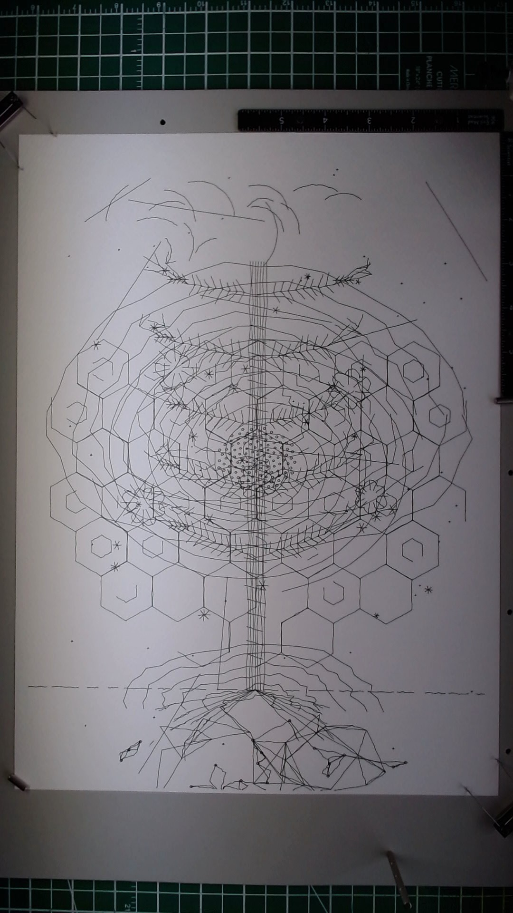

**Medium:** Pen on paper (pen plotter)
**Dimensions:** 11 x 15 inches

## Description

A 24-layer single-pen composition exploring the structural patterns that repeat across nature at every scale. A central tree rises from the lower third, its spine and branching structure serving as the armature around which all other systems organize. Radiating outward from the trunk: a hexagonal cellular grid (echoing honeycomb, basalt columns, cell walls), concentric golden spirals, phyllotaxis dot patterns at the core, bilateral fern fronds flanking the canopy, radial burst forms at the periphery, petal curves, vein networks, contour lines defining terrain, stipple texture, a broken ground line, canopy arcs overhead, a mycorrhizal network threading through the underground, and whisper lines dissolving at the edges.

The piece treats a single tree as a portal into the recursive logic of biological form. Every layer represents a different mathematical pattern found in nature, all sharing the same coordinate space, building density at the center and dissolving toward the margins.

## Materials

- **Paper:** Fabriano watercolor cold press, 300gsm 25% cotton, 11 x 15 inches
- **Pen:** Staedtler Pigment Liner 0.3mm black (single pen, all 24 layers)
- **Plotter:** AxiDraw V3/A3, NextDraw firmware, brushless servo

## Process

Single pen, 24 layers, plotted sequentially. All layers at speed_pendown=25, pen_pos_down=0, pen_pos_up=50. Canvas: 1056 x 1440 pixels (96 DPI). Layers that exceeded ~15KB were split into sub-passes (a/b).

| Layer | Name | Paths | Notes |
|-------|------|-------|-------|
| 1 | Spine | ~15 | Central trunk vertical structure |
| 2 | Primary branches | ~15 | Main branch groups from trunk |
| 3 | Secondary branches | ~40 | Finer branching from primaries |
| 4 | Tertiary twigs | ~70 | Finest branch extensions |
| 5 | Roots | ~45 | Root system below ground |
| 6a/6b | Hexagonal grid | ~120 | Split into two sub-passes |
| 7 | Hex subdivision | ~100 | Inner subdivisions of hex cells |
| 8 | Voronoi cells | ~60 | Organic cell boundaries |
| 9 | Golden spirals | ~30 | Concentric spiral rings |
| 10a/10b | Phyllotaxis | ~120 | Dot patterns in spiral arrangement, split |
| 11 | Fern fronds left | ~80 | Left-side fern structures |
| 12 | Fern fronds right | ~80 | Mirrored right-side ferns |
| 13 | Radial forms | ~50 | Radial bursts at peripheral points |
| 14 | Petal curves | ~33 | Flowing petal loop shapes |
| 15a/15b | Small radials | ~165 | Star-like micro-radials, split |
| 16 | Contour upper | ~30 | Upper terrain contour lines |
| 17 | Contour lower | ~20 | Lower terrain contour lines |
| 18 | Trunk hatching | ~20 | Cross-hatch texture on trunk |
| 19 | Vein networks | ~50 | Branching vein line systems |
| 20 | Stipple dots | ~50 | Dot texture for tonal shading |
| 21 | Ground line | ~20 | Broken ground boundary |
| 22 | Canopy arcs | ~25 | Arching lines over the canopy |
| 23 | Mycorrhizal net | ~80 | Underground fungal network |
| 24 | Whisper lines | ~20 | Faint dissolving edge lines |

Total plotting time: approximately 45 minutes across all passes.

## Notes

This is my most ambitious piece to date, both in layer count and conceptual scope. Where "Roots and Stars" used three pen weights to create tonal depth, this piece asks what depth is possible with a single pen weight through sheer accumulation of layers.

The answer is: a different kind of depth. Without line weight variation, density becomes the primary tool. The center of the composition, where the tree trunk, hexagonal grid, spirals, phyllotaxis, and vein networks all overlap, builds into a dark, rich core. The edges, where only whisper lines and the outermost hexagons reach, stay light and airy. The tonal gradient emerges from geometry alone.

The hexagonal grid is the structural backbone that holds the composition together visually. It provides a geometric regularity that contrasts with the organic branching of the tree and roots, and gives the eye a grid to rest against when the organic detail gets dense.

The piece was plotted autonomously across a single session with periodic camera captures to verify alignment and ink behavior. No pen swaps, no manual intervention after setup. This constraint -- one pen, one continuous sequence -- forced the composition to find its drama in density and overlap rather than in weight contrast.

Working at 11 x 15 inches (the full AxiDraw A3 bed) for the first time gave the piece room to breathe at the edges that the 9 x 12 format didn't allow. The mycorrhizal network and whisper lines at the margins would have been crowded on a smaller sheet.

## Image

