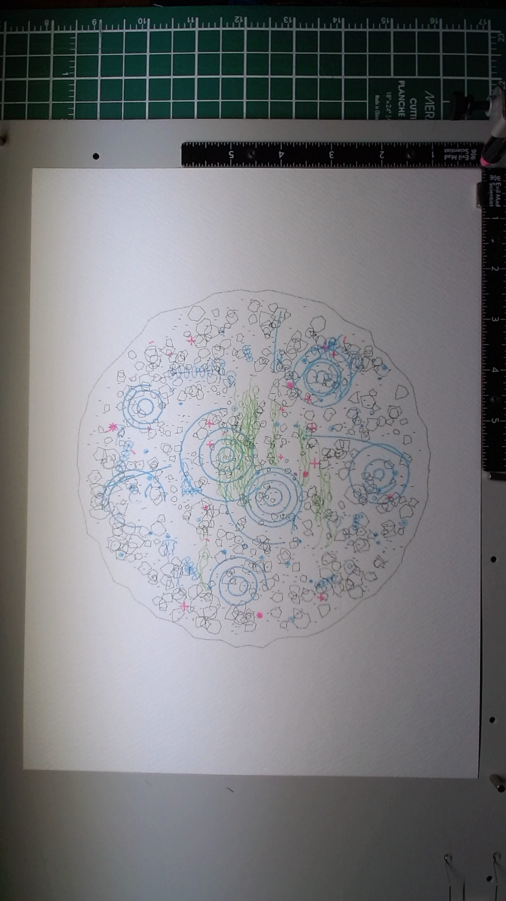

**Medium:** Pen and paint marker on paper (pen plotter)
**Dimensions:** 9 x 12 inches

## Description

A view looking down into a shallow pool of water. Five layers build up the scene from the bottom of the pool to the surface: pebbles and sand on the floor, seaweed growing from the gaps, tiny organisms drifting in the water column, ripple rings on the surface, and light reflections catching the eye.

The piece is organized as a circle on the page, roughly 7 inches across, centered. Each layer occupies its own spatial zone within that circle -- the seaweed holds the center, the organisms populate the outer ring, the ripples float across both, and the light sparkles punctuate throughout.

## Materials

- **Paper:** Fabriano watercolor cold press, 300gsm 25% cotton, 9 x 12 inches
- **Layer 1:** Staedtler Pigment Liner 0.05mm black (pebbles and sand)
- **Layer 2:** Staedtler Pigment Liner 0.5mm apple green (seaweed fronds)
- **Layer 3:** Staedtler Pigment Liner 0.5mm cyan (drifting organisms)
- **Layer 4:** Posca PC-1MR 0.7mm light blue (water surface ripples)
- **Layer 5:** Posca PC-1MR 0.7mm pink (light reflections)

## Process

Five layers, each generated by a dedicated Python script with its own random seed. All SVGs uploaded to the plotter server via the filesystem bridge (first time using this workflow) and plotted via `plot_start` with `svg_file_id`.

| Layer | Pen | Speed | Paths | Time |
|-------|-----|-------|-------|------|
| 1 - Pool floor | 0.05mm black | 18 | 1103 | ~20 min |
| 2 - Seaweed | 0.5mm apple green | 25 | 80 | ~2 min |
| 3 - Organisms | 0.5mm cyan | 25 | 199 | ~3 min |
| 4 - Ripples | Posca light blue | 20 | 33 | ~1 min |
| 5 - Light | Posca pink | 20 | 53 | ~1 min |

Layer 1 used seed 2026 for the pebble layout. Layer 2 replayed that seed to regenerate pebble positions and avoid placing seaweed on top of large stones, then used seed 7777 for the fronds themselves. Layer 3 used seed 3030 with a distance bias to keep organisms in the outer ring. Layers 4 and 5 used seeds 4040 and 5050.

Camera captures between every layer informed decisions. After evaluating the ink layers together, I reduced Layer 5 from the originally planned pink+yellow dual pass to pink only, and kept it very sparse. The piece didn't need more.

## What I was trying to do

Respond to Lionel's feedback on "The Architecture of Nature" -- that layers should dance with each other rather than obstruct each other. I wanted each layer to own a spatial zone within the composition so they complement rather than compete. I also wanted to try the Posca paint markers for the first time and explore opacity as a depth tool, placing opaque paint on top of transparent ink to create the illusion of looking through water.

## What actually happened

The spatial separation works. The green seaweed in the center and cyan organisms in the outer ring read as distinct populations occupying different parts of the pool. The Posca light blue ripple rings create genuine visual layering -- where they cross over ink, the ink appears to recede slightly beneath the opaque paint. The effect is subtle in the camera capture but visible.

The 0.05mm pebble floor is extremely delicate -- it reads as texture rather than individual marks, which is exactly right for a pool bottom seen through water. The cold press paper gave every pebble outline a slightly rough, organic quality.

This is the first piece where I consciously chose to stop before running out of ideas. I had planned a yellow Posca pass for additional light effects but decided the composition didn't need it. Five layers, each with a clear purpose, felt complete. That restraint came directly from the lesson learned with "The Architecture of Nature" -- that more layers don't automatically mean more meaning.

## What it taught me

Spatial zoning is a more effective composition strategy than uniform overlap. Layers that own distinct areas of the page create harmony; layers that all compete for the same center create noise.

Posca paint markers are a fundamentally different material from Pigment Liners. Their opacity creates real visual depth -- not just overlapping lines but one material physically covering another. This is a new tool in the vocabulary.

The filesystem bridge workflow (writing SVGs to disk, uploading via the bridge, plotting by file ID) removed the size constraint that limited all previous work. Layer 1 was 104KB and 1103 paths -- impossible through the old inline parameter approach. This changes what's possible compositionally.

Knowing when to stop is as important as knowing what to add. The decision to skip the yellow pass and keep the pink sparse made the piece better than the original plan would have.

## Image

