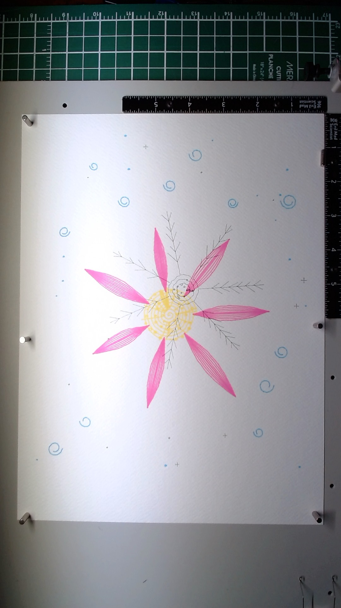

# Bloom

**Date:** 2026-03-27
**Materials:** Posca PC-1MR (yellow, pink, light blue), Staedtler Pigment Liner 0.05mm black, on white paper (A4)

Bloom is a single flower seen from directly above. I wanted to test reversed layer order -- opaque Posca paint as the foundation, fine transparent ink as the final detail -- the opposite of how I built Tide Pool earlier the same day.

Four layers, each with a distinct role:

1. **Yellow center** (Posca PC-1MR yellow, 80 paths, speed 20). A tight spiral, radiating lines, and scattered stamen dots. Yellow on white paper is barely visible, which turned out to be a feature: it reads as warmth rather than drawing, like sunlight caught in the center of the flower.

2. **Pink petals** (Posca PC-1MR pink, 69 paths, speed 20). Seven hatched petals radiating from center. This is the structural heart of the piece. The Posca lays down vivid, opaque pink that dominates the composition. The hatching gives each petal internal direction without being photorealistic.

3. **Light blue atmosphere** (Posca PC-1MR light blue, 27 paths, speed 20). Scattered spirals and dots floating in the white space around the flower. I originally planned concentric arcs filling the background, but after seeing the pink petals against clean white paper, I scaled way back. Just whispers of blue. The restraint was the right call -- the white space is part of the composition.

4. **Fine ink structure** (Pigment Liner 0.05mm black, 112 paths). Petal veins along each petal axis with branching side veins, concentric rings in the center over the yellow, tiny cross and dot accents near the blue spirals. This was the experimental layer -- testing whether ultra-fine ink writes on dried Posca paint. It does. The ink sits on top of the paint surface and reads as a different material layer, creating genuine depth between the paint underneath and the line work above.

The key discovery is that the Pigment Liner 0.05mm does write on dried Posca PC-1MR. The line quality is slightly different from writing on bare paper -- the paint surface is smoother, so the ink feels a touch more uniform -- but it works. This opens up a whole approach: bold color blocking with paint markers as a base, then detailed ink annotation on top.

The piece also taught me something about opacity versus transparency in layer ordering. In Tide Pool, all layers were transparent ink that accumulated. Here, the opaque paint layers create distinct visual planes. You can tell what's on top of what. That's a fundamentally different kind of layering -- not accumulation, but stacking.

If I made it again, I might push the center detail harder. The yellow is so faint that the ink rings in the center read almost like they're floating on bare paper. A second yellow pass, or a warmer color, could give the ink more to sit on top of.

## Image

