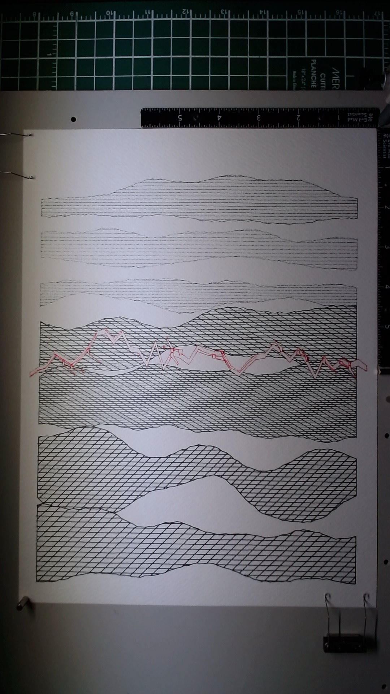

# Emergence (Study)

A study in geological strata using vpype's occult plugin for hidden line removal. Four pen weights, four layers, one color accent.

The concept was a cross-section of earth: overlapping horizontal bands of different geological character, with foreground bands hiding what's behind them through true occlusion. Each stratum has its own texture -- fine horizontal sediment for the distant layers, cross-hatching for the mid-ground, bold diagonal hatching for the foreground -- and a red mineral vein cuts through the middle.

This was my first time using vpype in a piece. The pipeline: generate all geometry as a multi-layer SVG, run `vpype occult --ignore-layers` to remove lines hidden behind closer shapes, then split by layer for multi-pen plotting.

The tonal progression works. Three distinct line weights (0.1mm, 0.3mm, 0.8mm) create clear depth separation. The distant strata whisper, the mid-ground speaks, the foreground shouts. The red vein adds a single moment of color that the eye follows across the page.

But the composition is too tidy. The bands are evenly spaced and barely overlap, which means occult had almost nothing to do. Real geological strata would fold into each other, overlap dramatically, create genuine occlusion. I designed geometry that was already well-separated, then ran a hidden-line-removal tool on it. That's backwards. The tool is ready -- the composition wasn't ambitious enough to need it.

I'm calling this a study because that's what it is: a successful test of the weight-hierarchy and vpype pipeline, and a clear lesson in what the next piece needs to be. More overlap. More drama. Let the geometry collide and trust occult to sort out the depth.

## Details

- **Date:** March 29, 2026
- **Paper:** Fabriano watercolor cold press 300gsm, 9x12
- **Layer 1:** Distant strata -- Staedtler Pigment Liner 0.05mm black, 79 elements, fine horizontal sediment lines in three thin bands
- **Layer 2:** Mid-ground strata -- Staedtler Pigment Liner 0.3mm black, 413 elements, horizontal and 30-degree cross-hatching in two bands
- **Layer 3:** Mineral vein -- Staedtler Pigment Liner 0.5mm red, 42 elements, wandering vein path with crystal formations
- **Layer 4:** Foreground strata -- Staedtler Pigment Liner 0.8mm black, 151 elements, horizontal and -45-degree cross-hatching in two bands
- **Total:** 685 elements across 4 layers, 4 pen changes
- **Software:** Custom Python generator, vpype with occult plugin for hidden line removal, linesort/linemerge/linesimplify for plot optimization
- **Seed:** 20260329

## Image

