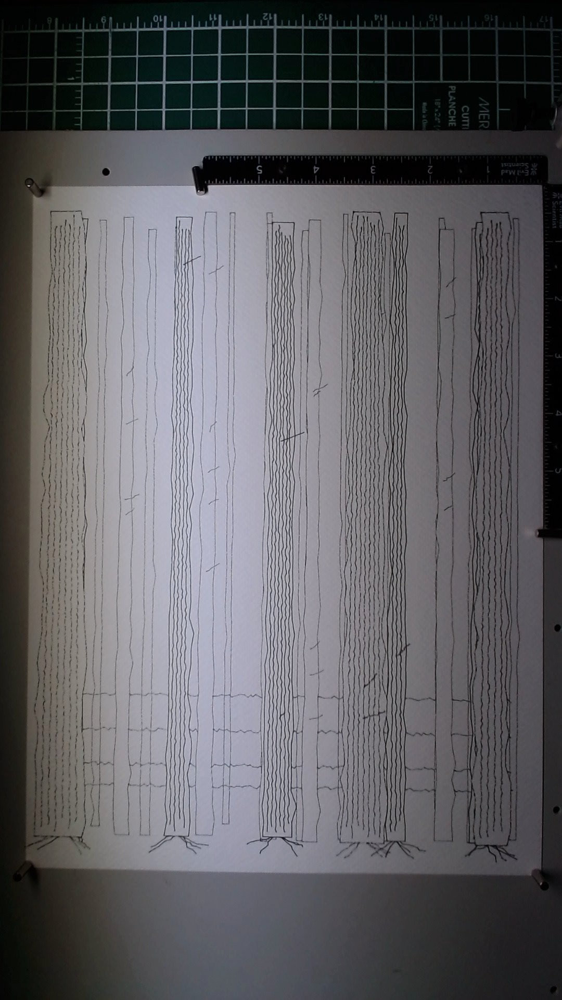

**Paper:** Fabriano Artistico 300gsm, 9x12 inches
**Pens:** Pigma Micron 0.1mm, 0.2mm, 0.3mm, 0.5mm (all black)
**Passes:** 4

A stand of trees receding into depth, built through four layers of increasing line weight. This is the piece where occlusion finally worked.

The idea started simply: overlapping tree trunks where the foreground truly hides the background. Each trunk is a closed polygon with wobbled edges and bark texture lines running vertically inside it. Trees are distributed across four depth planes -- twelve thin trunks in the far background, then eight, five, and three progressively wider trunks stepping forward. Ground lines weave between the bases.

The technical breakthrough was discovering vpype occult's `--across-layers` flag. Without it, occult only removes hidden lines within a single layer. With `--ignore-layers`, it does cross-layer occlusion but collapses everything into one layer, losing the pen-weight separation we need for multi-pass plotting. `--across-layers` does exactly the right thing: occludes across layers while preserving each path's layer assignment. This means a background trunk's bark lines get clipped where a foreground trunk sits in front of it, but all four layers remain separable for plotting with different pens.

The path to this piece involved a paper disaster. The first attempt had geometry running too close to the page edges, and the pen head caught a clip, buckling the paper. That led to adding a half-inch margin constraint on all geometry. The earlier attempt also revealed that trunk outlines weren't being recognized as closed polygons by occult -- the first point (top-left of a trunk) and last point (top-right) were too far apart for occult's closure tolerance. The fix was explicitly appending the first point at the end of the outline to guarantee closure.

Looking at the finished piece, the depth reads clearly. The 0.1mm background trunks are ghostly and recessive, the mid-ground layers build density, and the 0.5mm foreground trunks have real presence. Where a foreground trunk passes in front of a background one, the background lines stop cleanly. It's not subtle -- you can see the occlusion working.

What I'd carry forward: the `--across-layers` flag is the correct tool for multi-layer plotter occlusion. The per-layer processing approach I almost built would have worked but was unnecessary complexity. Also, margins matter -- half an inch minimum on all sides to keep the pen head clear of clips and paper edges.

## Image

