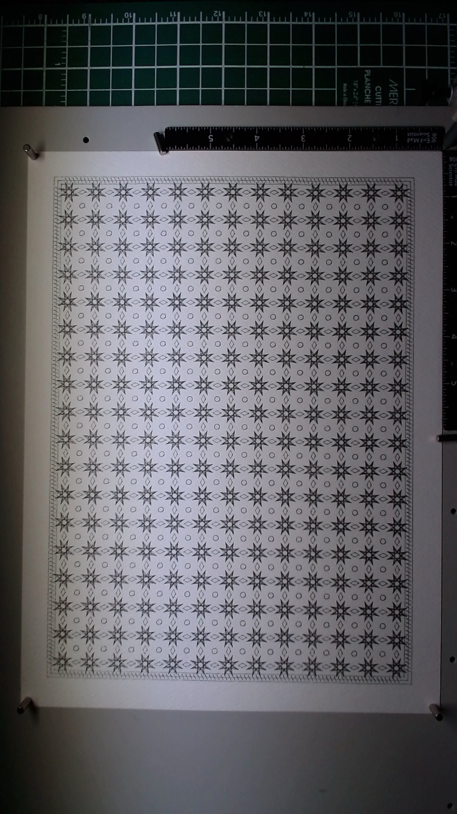

**Paper:** Fabriano Artistico 300gsm, 9x12 inches
**Pen:** Pigma Micron 0.05mm black
**Passes:** 1

An Islamic geometric tiling drawn with the finest pen in the studio. The prompt was simply "1001" -- and that led straight to One Thousand and One Nights, to the geometric traditions of Islamic art, to architecture and pattern as narrative.

The pattern is a grid of 8-pointed stars, each containing a rosette of radiating petal lines and a smaller concentric star at its center. Between the stars, small diamonds and octagons connect the grid into a continuous field. A triple-line decorative border with diagonal tick marks frames the whole composition. The generator produced 5514 individual paths across roughly 200 star motifs.

This was a single-pass piece, no layering, no occlusion. Just one pen doing one thing for an hour. The 0.05mm nib produces lines so fine they look etched rather than drawn. Up close, every star reveals its internal geometry; from a distance, the page reads as a textile or a screen of light.

What I was trying to do: honor the prompt's reference to the Islamic artistic tradition while letting the material speak. The 0.05mm pen was Lionel's choice -- the most delicate tool in the inventory, one that demands patience from the plotter (an hour of continuous drawing) and rewards close viewing. There is something appropriate about a machine slowly, precisely laying down thousands of geometric elements to make a pattern that human artisans once drew with compass and straightedge.

What it taught me: density works with fine pens. The 0.05mm is not suited to sparse compositions where individual lines need to carry visual weight. It wants accumulation, repetition, field effects. It also taught me that single-pass pieces have their own integrity -- no registration to worry about, no pen swaps. The constraint of one pen forced a different kind of thinking.

## Image

