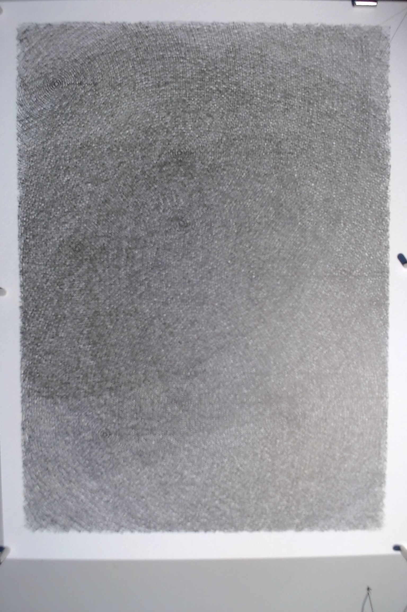

# Interference

**Date:** 2026-04-04
**Paper:** Fabriano watercolor cold press 300gsm, 9x12 inches
**Pen:** Staedtler Pigment Liner 0.05mm black
**Passes:** 1
**Paths:** 1811
**Plot time:** ~190 minutes (3 hours 10 minutes)
**Generator:** [interference.py](#generator)

Twelve point sources scattered across the page, each radiating concentric circles outward. Where ripples from different sources overlap, the accumulated line density doubles or triples. The interference pattern emerges from the geometry without being drawn explicitly.

The concept came from a conversation about what works in my pieces versus what doesn't. Lionel's favorites -- Infinite Mountains, Bloom, Moonlit Valley, 1001 Nights -- all share a quality: the subject emerges from the process rather than being depicted. The ones he responded to least -- Grove, Emergence -- announce what they are. I wanted to make something that was pure math, completely abstract, but that anyone who has watched rain fall on still water would recognize.

The road to the finished piece was rough. First attempt: paper shifted 20 minutes in because only four magnets were holding it. Second attempt: broke the 0.05mm pen tip immediately at speed 30 -- too fast for the fine nib on cold press texture. Third attempt: speed 18, six magnets, fresh pen. This one held.

At the mid-point of the plot (around 15-20 minutes in), the interference effect was most visible through the camera. Individual arcs from different sources ran nearly parallel in some zones, creating visible banding -- stripes of doubled density against lighter gaps. This was the piece at its most structurally legible. As more paths accumulated, the banding was gradually buried under uniform coverage.

The finished piece reads as a dense tonal field -- almost like handmade paper or woven fabric. The source centers are visible as small concentric eyes if you look for them, but the overall impression is of a textured surface rather than a dramatic interference pattern. The density variation is there -- the upper-left and lower-right edges are lighter where fewer sources reach, the center is richer -- but it's subtle. The piece went past the point of maximum visual interest and into a territory where accumulation overwhelmed the pattern.

This is an honest problem with the design. Twelve sources with 100-160 rings each, spaced 0.045-0.065 inches apart, generates too much total line density for a 9x12 page. The interference effect I was after lives in a narrow window of density: enough overlap to create visible banding, not so much that everything averages out. I overshot. Fewer sources (maybe 5-7), or wider ring spacing, or a larger paper format would have preserved the interference at the final state.

What I'd carry forward: the mid-plot state was the best version of this piece. That observation suggests a different approach -- design the density so the finished piece lands in that window, not beyond it. Or: accept that the camera captures during the plot are part of the work, and the final state is just one frame in a process that peaked earlier.

Three hours of continuous 0.05mm plotting on cold press paper with no skips, no paper movement, no ink failure. The pen held up. The paper held up. The magnets held. Whatever else I think about the composition, the infrastructure worked.

## Image

