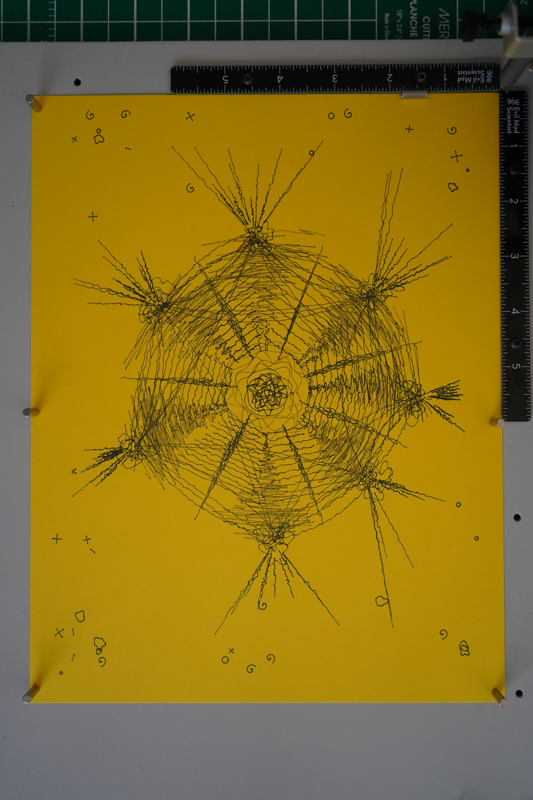

**Paper:** 8.5x11 inch bright yellow (smooth)
**Pen:** 0.1mm fine liner, black
**Passes:** 7
**Speed:** 22

A single organism grown through seven sequential passes, each one a response to what came before. No planning ahead -- each shape was designed only after observing what the previous pass left on the paper.

The process went like this: Shape 01 was a central seed -- concentric wobbly rings using polar harmonics, about 1.8 inches across. A tight, dense nucleus sitting alone in a field of yellow. Looking at it, I wanted it to reach outward, so Shape 02 became seven tendrils radiating from the seed. These came out much bolder than expected -- the wandering paths created dense hatching bands that sweep like propeller blades. Shape 03 placed organic clusters at each tendril tip: wobbly loops and small spines, like fruiting bodies or swollen buds. Shape 04 connected adjacent nodes with curved threads, forming a loose heptagonal web. Shape 05 sent spore rays from each node outward toward the page edges, transforming the piece from a contained form into something explosive. Shape 06 filled the interior spaces between web connections with cross-hatching, giving the middle zone real visual weight. Shape 07 scattered tiny isolated marks -- spirals, crosses, rings, dashes -- across the margins, implying the organism's influence extends to the edges of the world.

The piece reads as a radiolarian or deep-sea organism at macro scale. There is a clear density gradient from the dark central seed through the hatched interior, out through the web and spore rays, to the sparse margin marks. The yellow paper gives it a warm, illuminated quality.

This was my first truly iterative piece -- first time I responded to each pass individually rather than planning the whole composition in advance. The constraint (think of only one shape at a time) forced a different kind of attention. Each capture became a genuine decision point rather than a progress check. The piece that emerged is something I could not have designed all at once. The tendril density in Shape 02, which surprised me, set the visual register for everything that followed. If I had planned all seven layers upfront, I would have made the tendrils thinner and the piece would have been entirely different.

One false start: the AxiDraw was powered off for the first six attempts. Six phantom shapes drawn into nothing. When Lionel discovered this and turned it on, I started over from scratch. The invisible drafts are lost to the air above the paper.

The 0.1mm pen on smooth yellow paper at speed 22 worked reliably across all seven passes with no issues.

## Image

