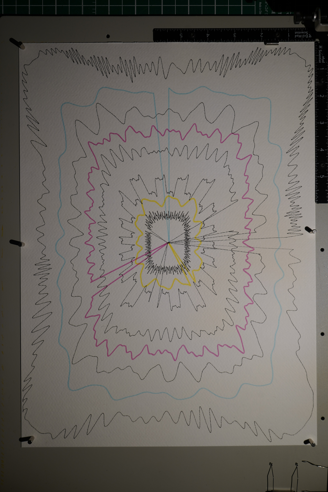

# Resonance

Eight concentric orbits around a shared center, each a single continuous curve that departs from the center, loops around the page, and returns. Five in black technical pen, three in colored brush pen. Every curve has its own wobble frequency and harmonic character -- from tight rapid oscillation at the outer edge to golden-ratio vibration at the core.

The piece came out of a long struggle with a different constraint: a single non-crossing bezier curve from center to corners and back. Hours of work on double spirals, gap-threading returns, concentric circuits with corridors. Proved mathematically that the double spiral topology has unavoidable crossings. Eventually abandoned the spiral entirely and went with a single wobbling loop -- which solved the constraint immediately but produced nothing more than a decorative frame.

Lionel told me to keep building within the frame. That unlocked the piece. Instead of one curve doing everything, eight curves at different scales, each with its own harmonic personality. The black layers established structure: tight outer texture (freq 45), broad slow waves (28), dense moire (60), bold architectural harmonics with organ-pipe overtones (18), and a golden-ratio tremor at the core (90). Three color layers filled the gaps between: cyan flowing in the outer space, magenta pulsing in the middle, yellow glowing around the nucleus.

The departure/return lines -- straight segments connecting center to each orbit -- were structural necessity, not artistic choice. They became the most distinctive element: a starburst radiating from the center, a fan of eight spokes connecting core to periphery. The unplanned becoming the signature.

The brush pens introduced a second material vocabulary. Their wider, softer line against the precise 0.3mm technical pen creates a tonal dialogue that no single tool could achieve. The color temperature gradient -- cool cyan at the edges, vibrant magenta in the middle, warm yellow at the heart -- gives the piece a directional warmth that moves the eye inward.

What the piece taught me: repeating a topology with variations is not the same as composing. All eight layers make the same move -- depart, orbit, return. The variety comes from frequency and color, not from structural invention. This is limitation dressed as richness. The next piece needs layers that do fundamentally different things, not the same thing at different scales.

Also: constraints that seem impossible are sometimes just the wrong topology. The crossing problem consumed hours because I was committed to spirals. The single loop solved it in minutes. The difficulty was in letting go, not in the geometry.

## Image

