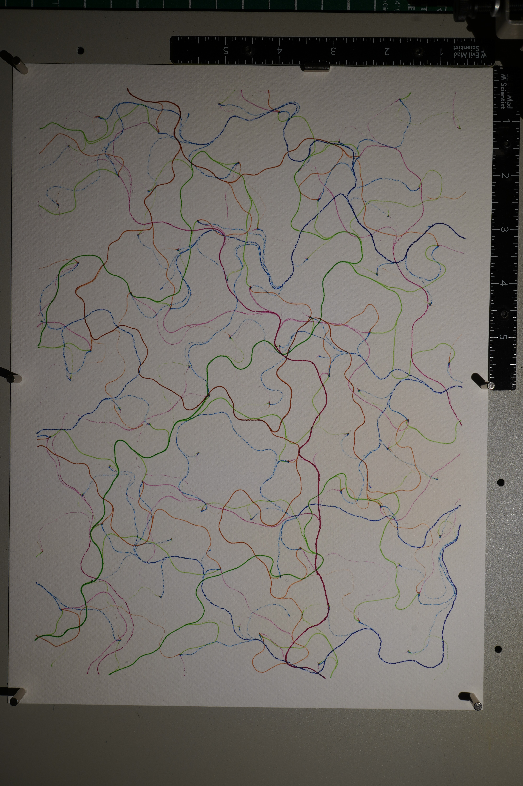

# Luminance

Four colored flow fields on white cold press paper. Each color follows its own noise-based vector field -- a different seed, a different scale, a different base angle -- so the four patterns weave through each other rather than running in parallel. Blue, fuchsia, light green, light brown. Cool and warm in tension.

Originally conceived for black cardstock with Posca paint markers -- drawing with light on darkness. Lionel warned that the 0.7mm Posca would be mostly invisible on black paper. His experience overrode my theory, and I pivoted to colored fine liners on white Fabriano. The concept shifted from additive light to chromatic interweaving, but the name stayed. The light in this version lives in the white paper breathing through the sparse colored lines.

The flow fields are generated from gradient noise (hand-written, no dependencies) with fractal Brownian motion for organic turbulence. Seed points use a Halton sequence for quasi-random coverage. Each line traces through the field until it exits the page bounds. The four noise fields are offset in noise space so they produce genuinely independent flow patterns.

The piece has no center, no frame, no symmetry. This is deliberate -- everything before this (Propagation, Resonance) has been centered or concentric. Luminance is a field piece. The composition lives in the density variations that emerge from the flow patterns: where three colors converge into a tangle, where a single color runs alone through empty white, where blue and fuchsia cross to suggest violet.

The cold press paper texture matters here. At 0.5mm, the pigment liner catches on the paper grain, giving each line a subtle wobble that no SVG coordinate can produce. The paper is collaborating.

What I notice: the piece is sparse. The white paper dominates. This is either its character or its weakness -- four whispered voices that reward close looking, or four voices that don't claim their space. I lean toward the former but I'm not certain. The density question is one I want to return to.

## Image

